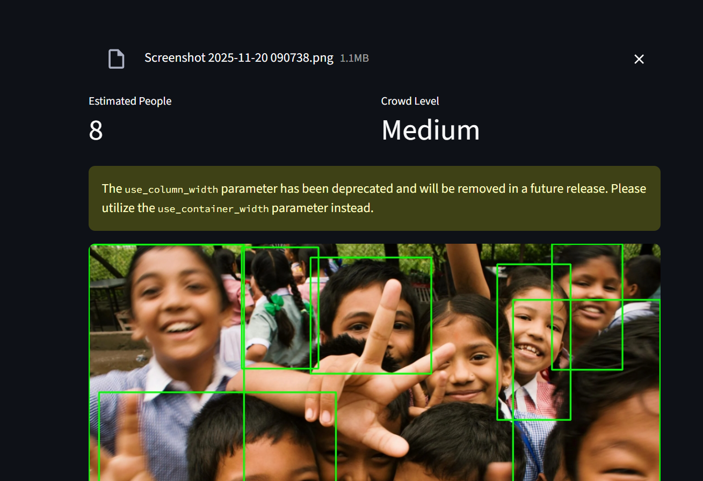

# 👁️ Face Detection & Crowd Management  
### Faster R-CNN (Custom Trained) + YOLOv8 + Streamlit UI

This project is an **end-to-end AI system** for:

- 🔍 **Face Detection**
- 👥 **Crowd Counting**
- 🚦 **Crowd Level Estimation** (Empty / Low / Medium / High)

It combines:
- **Custom-trained Faster R-CNN** (trained on the FDDB dataset)  
- **YOLOv8** for fast real-time detection  
- **Streamlit** for an interactive UI  

---

## 🖼️ **Project Output Screenshot**





---

## 🚀 **Features**

### 🧠 **1. Dual Model Support**
- **YOLOv8 (Fast)** → great for larger crowds & fast detection  
- **Faster R-CNN (Your custom model)** → trained from scratch on FDDB  

### 📷 **2. Webcam Snapshot Detection**
Uses `st.camera_input` to capture a webcam image and detect:

- Number of faces  
- Crowd level  
- Bounding boxes  

### 📂 **3. Image Upload Detection**
Upload any `.jpg/.png` and get:

- Face count  
- Crowd level  
- Downloadable processed image  

### 👥 **4. Crowd Management Logic**

Crowd level is decided by face count:

| Faces Detected | Crowd Level |
|----------------|-------------|
| `0`            | Empty       |
| `1–4`          | Low         |
| `5–14`         | Medium      |
| `15+`          | High        |

You can tune these thresholds in `get_crowd_level()`.

---

## 📦 **Tech Stack**

- Python  
- PyTorch  
- TorchVision (Faster R-CNN)  
- YOLOv8 (Ultralytics)  
- OpenCV  
- NumPy  
- Streamlit  

---

## 📁 **Project Structure**

face-detection-project/
├── data/
│ └── fddb/ # FDDB dataset (ignored in git)
│ ├── originalPics/
│ └── ellipseList.txt
├── outputs/
│ └── checkpoints/
│ └── facercnn.pth # Your trained model (ignored in git)
├── src/
│ ├── datasets.py
│ ├── transforms.py
│ ├── utils.py
│ ├── fddb_to_coco.py
│ ├── train.py
│ └── face_detection_app.py # Streamlit App (with Crowd Management)
├── scripts/
│ └── make_sample_ellipselist.py
├── requirements.txt
└── README.md

yaml
Copy code

---

## 🔧 **Installation Guide**

### 1️⃣ Clone the repository
```bash
git clone https://github.com/<your-username>/<repo-name>.git
cd face-detection-project
2️⃣ Create virtual environment
bash
Copy code
python -m venv .venv
.venv\Scripts\activate  # Windows

# or
source .venv/bin/activate  # Mac/Linux
3️⃣ Install dependencies
bash
Copy code
pip install -r requirements.txt
⚠ Install PyTorch from https://pytorch.org based on your system.

📥 Dataset Setup (FDDB)
Download FDDB images

Place them in:

bash
Copy code
data/fddb/originalPics/
Ensure ellipseList.txt exists

Convert annotations to COCO:

bash
Copy code
python src/fddb_to_coco.py
🧪 Train the Faster R-CNN Model
bash
Copy code
python -m src.train
Model will be saved to:

bash
Copy code
outputs/checkpoints/facercnn.pth
🌐 Run the Streamlit App
bash
Copy code
streamlit run src/face_detection_app.py
Features:

Model switch (YOLOv8 / Faster R-CNN)

Webcam snapshot detection

Image upload detection

Crowd counting

Crowd level badges

Downloadable output image

🏗️ Future Enhancements
📈 Live crowd graph

💾 Logging crowd count to CSV

🔔 Crowd alerts when level is “High”

👤 Age/Gender estimation

🔒 Face blurring for privacy


👤 Author

Anirudh Nair
AI Developer | ML Engineer
https://www.linkedin.com/in/anirudh071/
